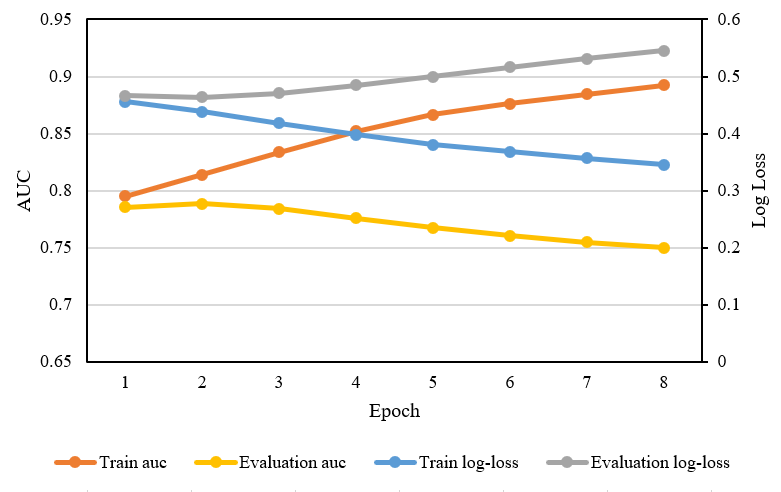

# BiPS-Model-Zoo
Recommendation Models Training with BiPS, currently only DeepFM is included.

## Steps to train DeepFM with BiPS

### Dataset Preparation

You need to download the criteo dataset, you can refer to the download and preprocessing instructions in [this repo](https://github.com/QimingZheng/Deep-Cross-Model).

BiPS requires that indices in the small field be contiguous (from 1 to the sum of feature number in each field) and the indices in the large field be contiguous.

### Install BiPS

Turn to BiPS [mainpage](https://github.com/QimingZheng/Recommender-System) for more information.

### Run training and evaluation

My running script, just for the reference.

```bash
export PATH=${HOME}/software/openmpi-4.0.4/build/bin/:$PATH
export MPI_LIB_ROOT=${HOME}/software/openmpi-4.0.4/build/lib/
export LD_LIBRARY_PATH=${HOME}/Lab/Recommender-System/build/lib/:${LD_LIBRARY_PATH}

export LAZY_UPDATE=1
export PARTITION_RATIO=90

export THREAD_POOL_SIZE=4

mpirun -np 6\
    ~/software/rec_venv/bin/python train.py\
    --cluster-config gpuc-02:0,1,-1,-1\
    --num-epoch 8\
    --log-interval 100\
    --batch-size 16384\
    --small-field 38\
    --large-field 1\
    --train-data ./data/train.data.csv\
    --train-label ./data/train.label.csv\
    --eval-data ./data/test.data.csv\
    --eval-label ./data/test.label.csv
```

Training/Evalution Curve:




